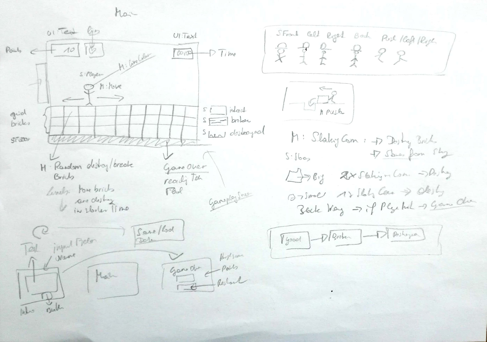

# constructionMan

This is a 2D minigame to practise Unity C# programming.
The player has to stuff randomly appearing holes in the floor by pushing bricks into the holes.
S/he is game over when a stone hits the player, the player falls into a hole or the player reaches the floor. 
The game has several levels. At level one only some holes apear. 
With increasing levels more holes apear in shorter time.  
A highscore with name, points, and time will be saved. 

Dev-platform: Win 10, Unity Version: 2018.2.14f1, Visual Studio Version: VS Community 2017, 15.3.9;
Scripting Runtime Version: .NET 4.x Equivalent
API Compatibility Level: .NET Standard 2.0

Target platform: Standalone (Reference Resolution: 1024 x 768)

Sketch Gameplay Screen 

